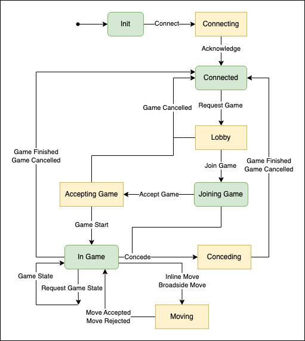

# API

```
Current API version : 0.1.0
```

This document records the text based API communication between the Abalone game and external controllers. It is split into two sections, the interface for the connection protocol, and the main game protocol. The text API uses the JSON format to communicate to / from the server.

Every message should be formatted like so,

```py
{
    "id": int,
    "content": {}
}
```

In internal documentation this is represented as `game_message_t`.

The following sections will define the `id` field of the message, alongside the layout of the content block, in the format,

### NAME (id)

```py
"content": {}
```

Message description.

- Sent from server to the client or client to the server.

## Connection

The following messages are used in the initial connection protocol.

### Connect (1)

```py
"content": {
    "version": "0.1.0",
    "magic": "ABALONE",
    "name" : str
}
```

Used to connect to a running abalone game instance.

- Sent by client to the server.

### Acknowledge (2)

```py
"content": {
    "version": "0.1.0",
    "name": str
}
```

Used to acknowledge a new connection request.

- Sent by server to the client.

## Game Protocol

The following commands are sent or received anytime after the acknowledgement message has been received from the server.

### Request Game (3)

```py
"content": {
    "desired_side": "black" | "white" | "none" | "random",
    "desired_start": "belgian" | "german" | "none" | "random"
}
```

Request to join a game, requesting a desired side. The following logic will occur when two players join a game with their player requests, either the players get their choices, or the teams are randomised.

For both of the desired options, if both players agree, then both players will get their desired choice, otherwise, the selection will be randomised.

- Sent by client to the server.

### Join Game (4)

```py
"content": {
    "other_player": str
}
```

Request from the server for the player to join a game, specifies the other player's name.

- Sent by server to the client.

### Accept Game (5)

```py
"content": {}
```

Accept a game with the other player.

- Sent by client to the server.

### Game Start (6)

```py
"content": {
    "game_state": game_state_t
}
```

Message from the server to indicate that the game has started.

- Sent by server to the client.

### Game Cancelled (7)

```py
"content": {
    "reason": str,
    "id": int
}
```

Used to indicate that the game with the following player was cancelled. This may be sent at any part of the game, apart from a successful conclusion to the game.

- Sent by server to the client.

### Request Move (8)

```py
"content": {}
```

Used to request a move from a client.

- Sent from server to the client.

### Request Game State (9)
```py
"content": {}
```

Request the current game state from the server.

- Sent from client to the server.

### Game State (10)
```py
"content": {
    "game_state": game_state_t
}
```

The current game state. 

- Sent by the server to the client.

### Inline Move (11)
```py
"content": {
    "last": game_position_t,
    "move": game_position_t
}
```

Execute an inline move. The `"last"` field indicates the last piece in the inline move, i.e. the one at the back. The `"move"` field indicates where that last piece has moved to.

- Sent by the client to the server.

### Broadside Move (12)
```py
"content": {
    "first": game_position_t,
    "last": game_position_t,
    "first_move": game_position_t
}
```

Execute a broadside move. The `"first"` and `"last"` fields indicate the first and last positions of the broadside move. The `"first_move"` field indicates the position that the first piece moved to in the broadside move.

- Sent by the client to the server.

### Move Accepted (13)
```py
"content": {
    "message": game_message_t
}
```

Indicates that the move contained in the `"message"` field was accepted and played.

- Sent by server to the client.

### Move Rejected (14)
```py
"content": {
    "message": game_message_t,
    "reason": str,
    "id": int
}
```

Indicates that the move contained in the `"message"` field was rejected and not played because of `"reason"` with reason id in `"id"`.

- Sent by server to the client.

### Game Finished (15)
```py
"content": {
    "won": bool,
    "winner": str
}
```

Indicates that the game has concluded, and whether the client has won or not, along with the name of the winner.

- Sent by server to the client.

### Concede (16)
```py
"content": {}
```

Concede the current game and allow the enemy to win.

- Sent by the client to the server.

### TODO

- Offer a draw.
- Lobby chat.
- Game chat.
- Observers.

## API Types

This section defines the various types used in the API.

### game_state_t
```py
game_state_t: [game_pieces_t]
```

### game_pieces_t
```py
game_pieces_t: {
    "pos": game_position_t,
    "piece": "w" | "b"
}
```

### game_position_t
```py
game_position_t: "[A-I]" + "[1-9]"
```

## Implementation Requirements

A client implementation needs to be able to send the following messages, 

- Connect (1)
- Request Game (3)
- Accept Game (5)
- Request Game State (9)
- Inline Move (11)
- Broadside Move (12)
- Concede (16)

A client implementation needs to be able to handle the following messages, 

- Acknowledge (2)
- Join Game (4)
- Game Start (6)
- Game Cancelled (7)
- Request Move (8)
- Game State (10)
- Move Accepted (13)
- Move Rejected (14)
- Game Finished (15)

The following diagram indicates a suggested client state machine for handling messages.

#### Key

- Green boxes represent states in which the client can send messages to the server.
- Yellow boxes represent states in which the client is waiting for the server to respond.

#### Transitions

- Transitions from green boxes to yellow boxes are caused by sending a message to the server.
- Transitions from yellow boxes to green boxes are caused by receiving a message from the server.
- Transitions from green boxes to green boxes are caused by receiving a message from the server.


